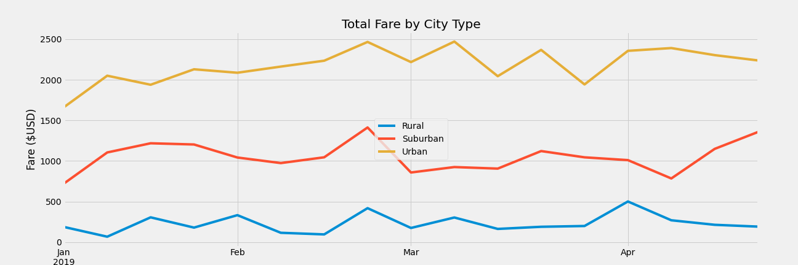

# PyBer Analysis

## Overview of Project

### Purpose

Our objective is to summarize PyBer's ride-sharing data by the city types Urban, Suburban, and Rural. The pinnacle of this analysis is creating a visual aide in the form of a multiple-line graph that displays the total weekly fares for each of the city types. To conclude, we will submit our observations of the differences between the city types and make recommendations on how the business can continue to improve.

### Resources

- Data Source: [city_data.csv](Resources/city_data.csv), [ride_data.csv](Resources/ride_data.csv)
- Software: Python 3.7.9, pandas 1.1.3, numpy 1.19.2, maplotlib 3.3.2, jupyter-notebook 6.1.4, Visual Studio Code 1.52.1

## Project Results

### Analysis
##### Summary by City Type 

When discussing city types we need to clarify that Rural areas are the least populous, Urban areas are the most populous, and Suburban areas fall inbetween. We see in our analysis (see above summary) that as population of the city type increases then the total rides, total drivers, and total fares increase. This relationship is described in more detail below:
- Total Rides
  - Suburban areas have 5x as many rides as Rural areas
  - Urban areas have 2.6x as many rides as Suburban areas
- Total Drivers
  - Suburban Areas have approximately 6.3x as many driver than Rural areas
  - Urban areas have approximately 4.9x as many drivers than Suburban areas.
- Total Fares
  - Suburban areas get about 4.5x as much in total fares than Rural areas
  - Urban areas get more than 2x as much in total fares than Suburban areas

However, we also see in our analysis that as population of the city type increases then the average fare per ride and average fare per driver decreases:
- Average Fare per Ride 
  - Average fare per rides in Suburban areas are 89% of that in Rural areas
  - Average fare per rides in Urban areas are 79% of that in Suburban areas
- Average Fare per Driver 
  - Average fare per driver in Suburban areas are 71% of that in Rural areas
  - Average fare per driver in Urban areas are 42% of that in Suburban areas

It was important for our analysis to visualize the data over time to help us identify any additional trends. From the graph below not only do we reinforce that the Urban areas receive the most in total fares, but we can also identify that all city types had a fare increase in the last week of February. It'll be important for PyBer to identify causes for events like this in order to make sure

## Summary

### Recommendations

1. The clearest conclusion from this analysis is that the majority of PyBer's business comes from Urban areas. The best way for more succes is to keep doing what works and that is too expand to more Urban cities.

2.  PyBer's average fare per driver in Urban areas is less than 30% the average fare per driver in Rural areas. My initial assumption is that there are too many drivers in certain Urban cities and in order to keep employees happy we do not want them competing with each other more than necessary. Resources need to better allocated.

3. Average fares per ride in Rural areas are about 12% higher than in Subruban areas and about 41% higher than in Urban areas. However, there were only 125 rides. PyBer needs to identify high traffic Rural areas (train stations, bus stops, etc.) to be able to capitalize and increase the volume on these high fare rides.
