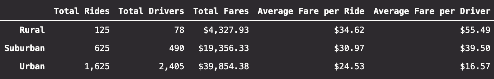

# PyBer Analysis

## Overview of Project

### Purpose

Our objective is to summarize PyBer's ride-sharing data by the city types Urban, Suburban, and Rural. The pinnacle of this analysis is creating a visual aide in the form of a multiple-line graph that displays the total weekly fares for each of the city types. To conclude, we will submit our observations of the differences between the city types and make recommendations on how the business can continue to improve.

### Resources

- Data Source: [city_data.csv](Resources/city_data.csv), [ride_data.csv](Resources/ride_data.csv)
- Software: Python 3.7.9, pandas 1.1.3, numpy 1.19.2, maplotlib 3.3.2 jupyter-notebook 6.1.4, Visual Studio Code 1.52.1

## Project Results

### Analysis
##### Summary by City Type 

When discussing city types we need to clarify that Rural areas are the least populous, Urban areas are the most populous, and Suburban areas fall inbetween. We see in our analysis (see above summary) that as population of the city type increases then the total rides, total drivers, and total fares increase. This relationship is described in more detail below:
- Total Rides
  - Suburban areas have 5x as many rides as Rural areas
  - Urban areas have 2.6x as many rides as Suburban areas
- Total Drivers
  - Suburban Areas have approximately 6.3x as many driver than Rural areas
  - Urban areas have approximately 4.9x as many drivers than Suburban areas.
- Total Fares
  - Suburban areas get about 4.5x as much in total fares than Rural areas
  - Urban areas get more than 2x as much in total fares than Suburban areas

However, we also see in our analysis that as population of the city type increases then the average fare per ride and average fare per driver decreases:
- Average Fare per Ride 
  - Suburban areas have 89% as many  as Rural areas
  - Urban areas have 79% as many  as Suburban areas
- Average Fare per Driver 
  - Suburban areas have 71% as many  as Rural areas
  - Urban areas have 42% as many  as Suburban areas

## Summary
There is a statement summarizing three business recommendations to the CEO for addressing any disparities among the city types. (4 pt)
### Recommendations
1. 
2. If our average fare per driver is so low in urban cities, does that mean we have to many people employed there? Can we better utilize our capital if these drivers are salary-based?
3. Are we missing out on high fare rides in rural areas because we do not have enough drivers in certain towns?
4. Why are average fares per ride in Urban areas 70% as much as average fares per rides in Rural areas?

 Average Fare per Ride (is this an indecation of travelling further or higher costs per mile)
- Average Fare per Driver (indication of too many drivers in certain areas?)
